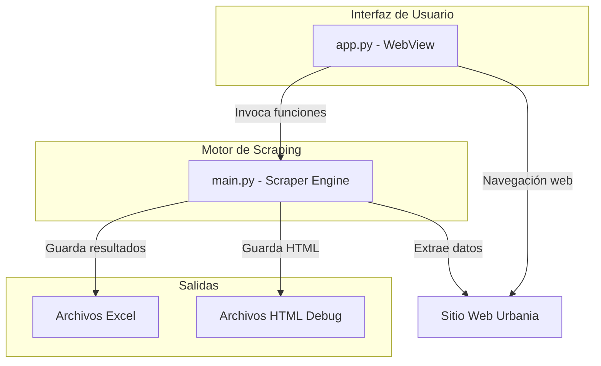
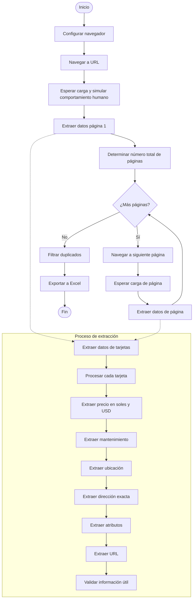
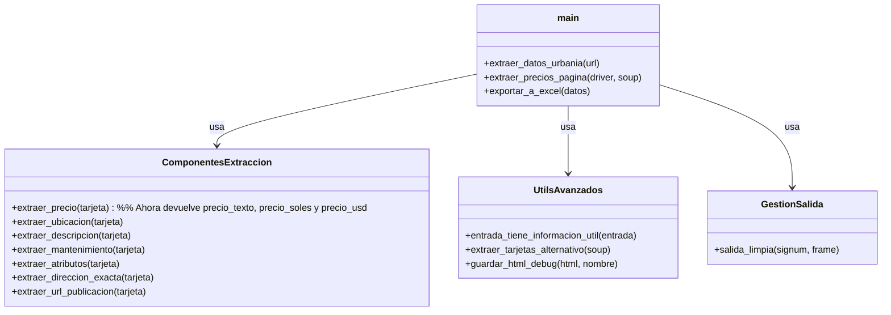
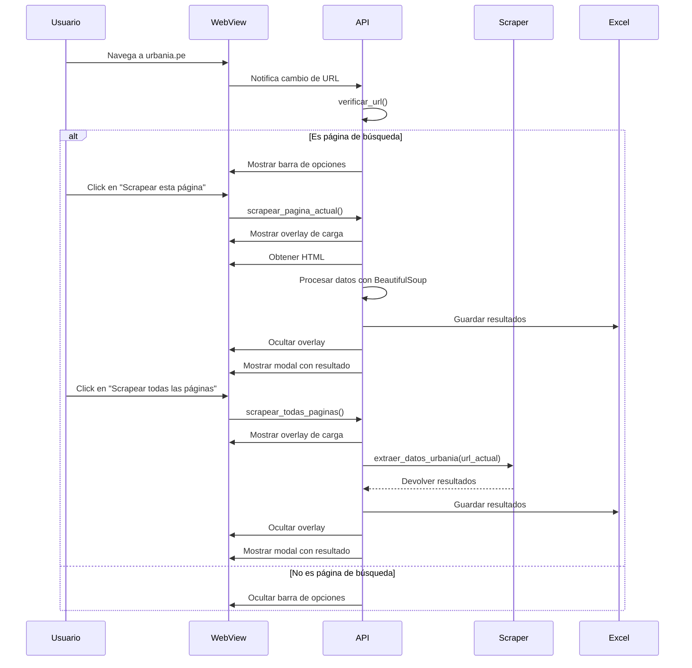
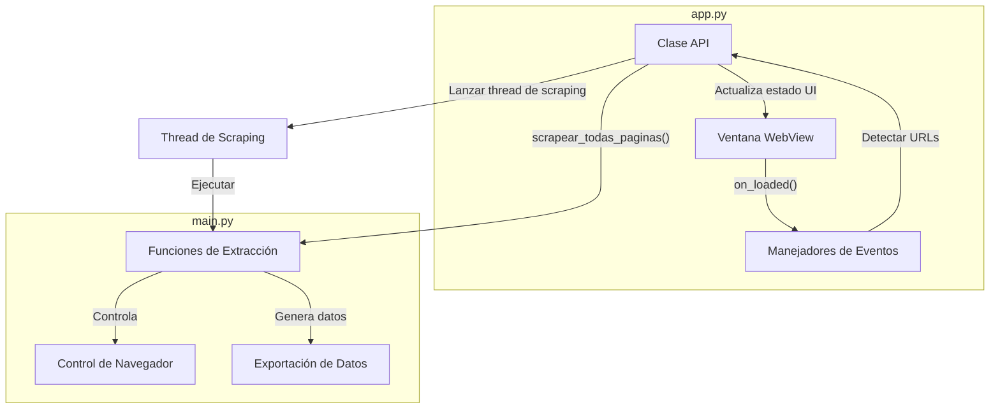
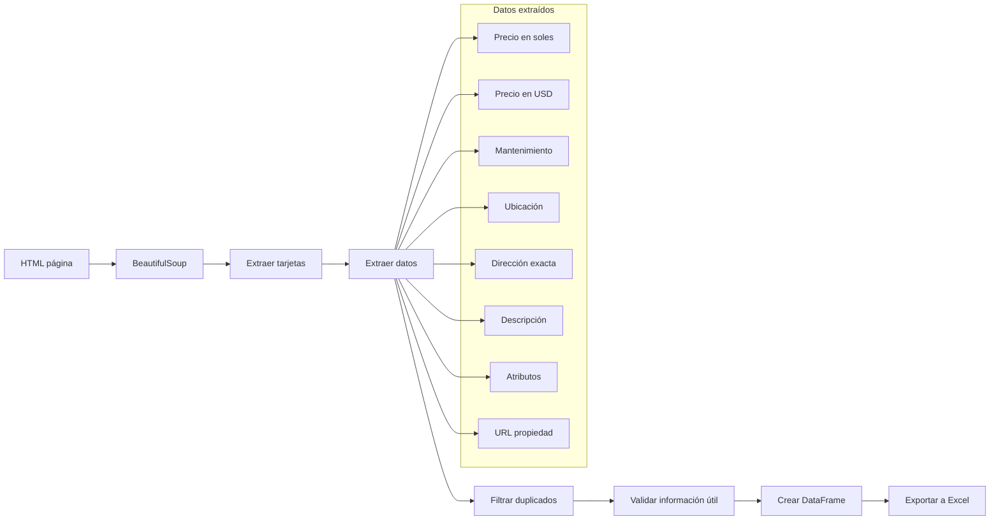
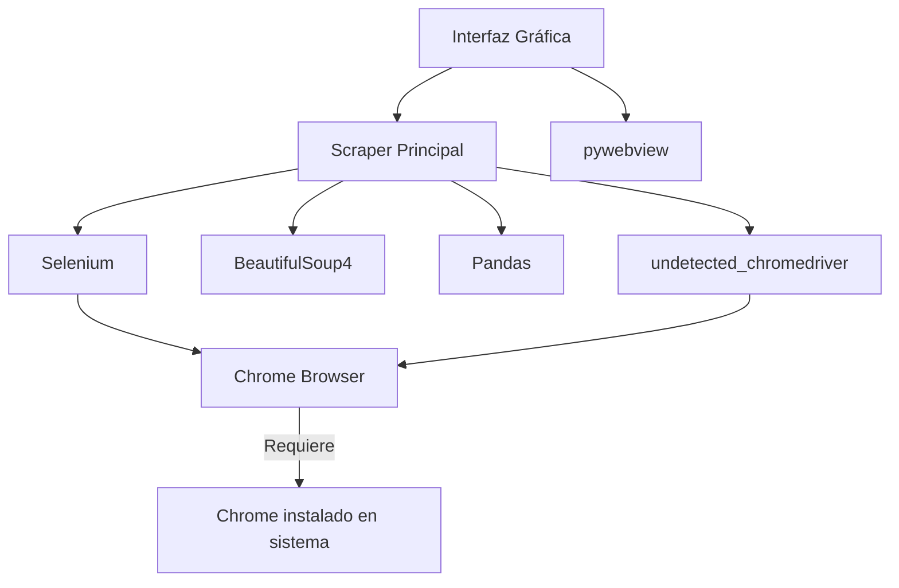
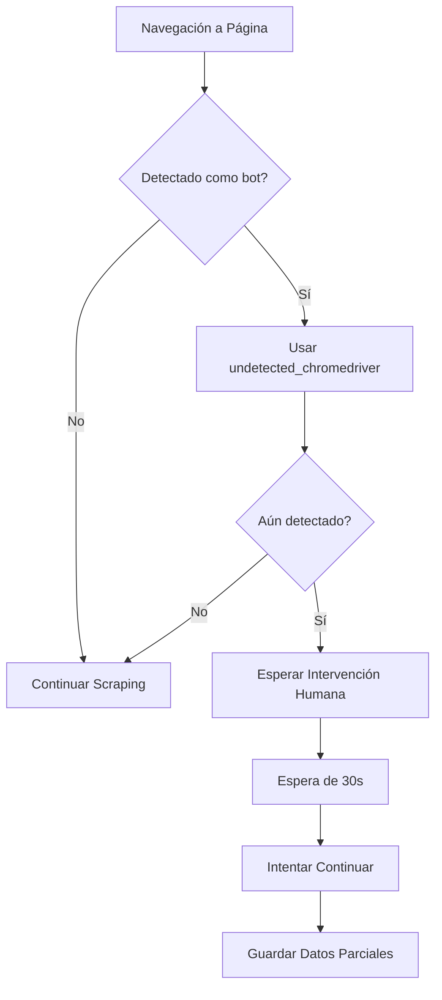
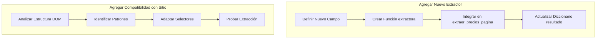
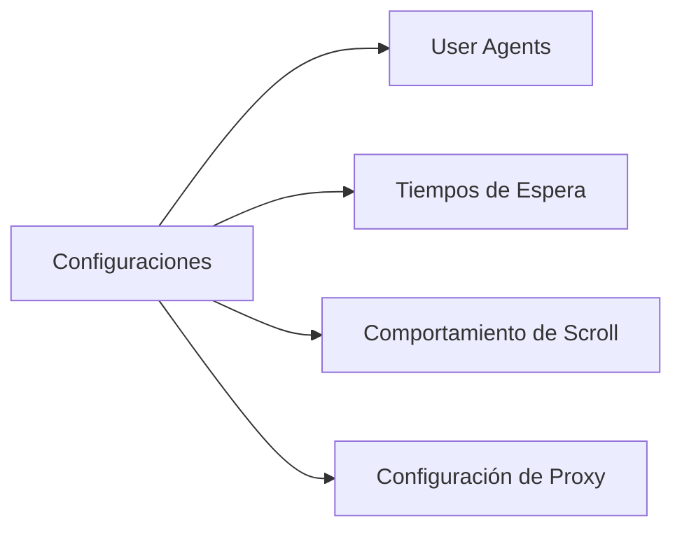

# Documentación Scraper Urbania

## Índice
- [Documentación Scraper Urbania](#documentación-scraper-urbania)
  - [Índice](#índice)
  - [Arquitectura General](#arquitectura-general)
  - [Flujo de Trabajo del Motor de Scraping (main.py)](#flujo-de-trabajo-del-motor-de-scraping-mainpy)
  - [Componentes del Motor de Scraping](#componentes-del-motor-de-scraping)
  - [Flujo de la Interfaz de Usuario (app.py)](#flujo-de-la-interfaz-de-usuario-apppy)
  - [Integración entre Componentes](#integración-entre-componentes)
  - [Flujo de Procesamiento de Datos](#flujo-de-procesamiento-de-datos)
  - [Uso del Sistema](#uso-del-sistema)
    - [Modo CLI (main.py)](#modo-cli-mainpy)
    - [Modo Interfaz Gráfica (app.py)](#modo-interfaz-gráfica-apppy)
  - [Estructura de Archivos de Salida](#estructura-de-archivos-de-salida)
  - [Requisitos del Sistema](#requisitos-del-sistema)
    - [Navegador Requerido](#navegador-requerido)
    - [Dependencias Principales](#dependencias-principales)
    - [Instalación de Dependencias](#instalación-de-dependencias)
    - [Requisitos de Hardware](#requisitos-de-hardware)
  - [Manejo de Situaciones Especiales](#manejo-de-situaciones-especiales)
    - [Detección de Anti-Bot y CAPTCHA](#detección-de-anti-bot-y-captcha)
    - [Estrategias Anti-Detección](#estrategias-anti-detección)
  - [Guía para Desarrolladores](#guía-para-desarrolladores)
    - [Extender la Funcionalidad](#extender-la-funcionalidad)
    - [Mejores Prácticas de Desarrollo](#mejores-prácticas-de-desarrollo)
  - [Limitaciones y Consideraciones](#limitaciones-y-consideraciones)
    - [Éticas y Legales](#éticas-y-legales)
    - [Técnicas](#técnicas)
  - [Configuraciones Avanzadas](#configuraciones-avanzadas)
    - [Parámetros Ajustables](#parámetros-ajustables)
    - [Ejemplo: Configuración de Proxy](#ejemplo-configuración-de-proxy)
  - [Preguntas Frecuentes (FAQ)](#preguntas-frecuentes-faq)
    - [¿Cómo manejar bloqueos de Cloudflare?](#cómo-manejar-bloqueos-de-cloudflare)
    - [¿Cómo extender para otros sitios inmobiliarios?](#cómo-extender-para-otros-sitios-inmobiliarios)
    - [¿Es posible ejecutar en modo headless?](#es-posible-ejecutar-en-modo-headless)
  - [Historial de Versiones y Actualizaciones](#historial-de-versiones-y-actualizaciones)
    - [v1.0.0](#v100)
    - [v1.1.0](#v110)

Esta documentación describe el funcionamiento del scraper para el sitio web Urbania, compuesto por dos componentes principales:
1. `main.py`: El motor de scraping principal
2. `app.py`: La interfaz gráfica basada en WebView

## Arquitectura General



## Flujo de Trabajo del Motor de Scraping (main.py)



## Componentes del Motor de Scraping



## Flujo de la Interfaz de Usuario (app.py)



## Integración entre Componentes



## Flujo de Procesamiento de Datos



## Uso del Sistema

### Modo CLI (main.py)
Para ejecutar el scraper en modo línea de comandos:
```
python main.py
```

El programa preguntará si desea ingresar una URL personalizada o usar la predeterminada.

### Modo Interfaz Gráfica (app.py)
Para iniciar la aplicación con interfaz gráfica:
```
python app.py
```

La aplicación abrirá una ventana de navegador donde puede:
1. Navegar normalmente por el sitio Urbania
2. Cuando esté en una página de resultados de búsqueda, aparecerá una barra de opciones
3. Seleccionar "Scrapear esta página" o "Scrapear todas las páginas"
4. Ver el progreso en tiempo real y el resultado final

## Estructura de Archivos de Salida

- **Resultados**: Guardados en la carpeta `resultados/`
  - Formato: Archivos Excel (.xlsx)
  - Nomenclatura: `precios_urbania_YYYYMMDD_HHMMSS.xlsx`
  
- **Archivos de depuración**: Guardados en la carpeta `debug/`
  - Formato: Archivos HTML
  - Nomenclatura: `pagina_debug_YYYYMMDD_HHMMSS.html`

## Requisitos del Sistema

### Navegador Requerido
- **Google Chrome**: El sistema requiere tener instalada una versión reciente de Google Chrome (preferiblemente versión 90 o superior)
- La aplicación utiliza ChromeDriver que se descarga automáticamente para coincidir con su versión de Chrome instalada

### Dependencias Principales


### Instalación de Dependencias
```
pip install selenium beautifulsoup4 pandas undetected-chromedriver pywebview webdriver-manager requests psutil
```

### Requisitos de Hardware
- Mínimo 4GB RAM
- Espacio en disco: 500MB para la aplicación y sus temporales
- Conexión a internet
- Navegador Google Chrome instalado en el sistema

## Manejo de Situaciones Especiales

### Detección de Anti-Bot y CAPTCHA



### Estrategias Anti-Detección
1. **User Agents Aleatorios**: Rotación de agentes de usuario en cada sesión
2. **Simulación Humana**: 
   - Scroll aleatorio y pausado
   - Tiempos de espera variables
   - Movimiento de ratón simulado
3. **Manejo de WebDriver**: Ocultando señales que identifican automatización
4. **Extracción Resistente**: Múltiples formas de extraer cada dato para adaptarse a cambios del sitio

## Guía para Desarrolladores

### Extender la Funcionalidad



### Mejores Prácticas de Desarrollo
1. **Usar Selectores Flexibles**: Siempre proporcionar alternativas en caso de cambios en el sitio
2. **Manejar Excepciones**: Envolver cada extracción en bloques try-except
3. **Validación de Datos**: Verificar que los datos extraídos tienen sentido
4. **Logging Detallado**: Mantener un registro extensivo para depuración

## Limitaciones y Consideraciones

### Éticas y Legales
- Respetar los términos de uso del sitio web
- Limitar la tasa de solicitudes para no sobrecargar el servidor
- Uso exclusivamente para investigación y análisis de mercado

### Técnicas
- Dependencia en la estructura actual del DOM del sitio
- Posibilidad de ser bloqueado en caso de uso intensivo
- Algunos datos pueden no estar disponibles o cambiar de formato

## Configuraciones Avanzadas

### Parámetros Ajustables



### Ejemplo: Configuración de Proxy
```python
options = uc.ChromeOptions()
options.add_argument('--proxy-server=ip:puerto')
```

## Preguntas Frecuentes (FAQ)

### ¿Cómo manejar bloqueos de Cloudflare?
El sistema intenta evitarlos mediante técnicas anti-detección. En caso de bloqueo persistente:
- Utilizar una espera más larga entre solicitudes
- Considerar el uso de proxies rotativas
- En último caso, resolver manualmente el CAPTCHA

### ¿Cómo extender para otros sitios inmobiliarios?
1. Analizar la estructura DOM del nuevo sitio
2. Crear funciones de extracción específicas
3. Adaptar la lógica de navegación entre páginas
4. Actualizar la validación de datos

### ¿Es posible ejecutar en modo headless?
Sí, pero aumenta el riesgo de detección. Para activarlo:
```python
options.add_argument('--headless')
```
Sin embargo, para sitios con protección anti-bot avanzada, no se recomienda.

## Historial de Versiones y Actualizaciones

### v1.0.0
- Implementación inicial con soporte para Urbania
- Interfaz CLI y GUI
- Extracción de datos básicos de propiedades

### v1.1.0
- Mejoras en la detección de elementos
- Optimización de tiempos de carga
- Reducción de falsos positivos
